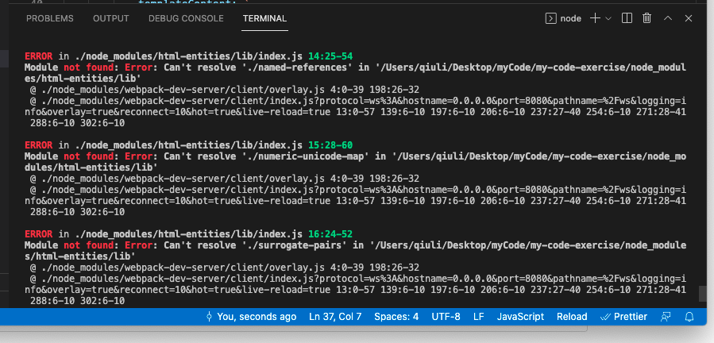

# 配置项目过程
## 环境
node  14.50.0(必须大于这个版本，不然babel会报错)
npm 

## 初始化项目
```
npm init
```

## 配置webpack
```
module.exports = {
	mode: 'development',
	devServer: {
		hot: true,
		open: true
	},
	entry: "./src/index.jsx",
	output: {
		filename: "[name].js",
		path: path.join(__dirname, "./dist"),
	},
}
```

## 配置jsx文件
```
yarn add -D webpack webpack-cli babel-loader @babel/core @babel/preset-react
```

webpack配置：
```
module: {
	rules: [{
		test: /\.jsx$/,
		loader: "babel-loader",
		options: {
			presets: ["@babel/preset-react"],
		}
	}]
}
```

## 配置热更新和html
```
yarn add -D webpack-dev-server html-webpack-plugin
```

配置webpack：
```
// 模版html
plugins: [
	new HtmlWebpackPlugin({
		templateContent: `
			<!DOCTYPE html>
			<html>
				<head>
					<meta charset="utf-8">
					<title>Webpack App</title>
				</head>
				<body>
					<div id="app" />
				</body>
			</html>
		`,
	}),
],

// 热更新
devServer: {
	hot: true,
	open: true
},
```

热更新执行：
```
npx webpack serve  
```

## 配置css
```
yarn add -D style-loader css-loader
```

webpack配置：
```
module.exports = { 
	module: { 
		rules: [ { 
			test: /\.css$/i, 
			use: ["style-loader", "css-loader"], 
		}, 
		], 
	}, 
};
```

## 配置typeScript
```bash
yarn add -D typescript ts-loader

// 安装babel方式
yarn add -D typescript @babel/preset-typescript

```

配置webpack：
```json
// 普通项目
rules: [ { test: /\.ts$/, use: 'ts-loader' }, ],

// react项目配置
rules: [ { test: /\.tsx$/, use: 'ts-loader', }, ],

// 配置自动识别对应文件的后缀 必须要加上.js我也不知道为什么
// https://stackoverflow.com/questions/43595555/webpack-cant-resolve-typescript-modules/43596713#43596713
resolve: { extensions: ['.tsx', '.jsx', '.js'], }
```

### 报错解决：
解决： https://stackoverflow.com/questions/43595555/webpack-cant-resolve-typescript-modules/4
resolve只配置了 `resolve: { extensions: ['.tsx', '.jsx',], }` ，构建后会报错：

```

ERROR in ./node_modules/html-entities/lib/index.js 14:25-54
Module not found: Error: Can't resolve './named-references' in '/Users/qiuli/Desktop/myCode/my-code-exercise/node_modules/html-entities/lib'
```
加上`.js`的配置就可以了


使用ts-loader还需要配置tsconfig-json文件:
```json
{ 
	"compilerOptions": { 
		"noImplicitAny": true, 
		"moduleResolution": "node",
		"jsx": "react-jsx" 
	} 
}
```

配置react的type
```bash
yarn add -D @types/react
```

### 报错解决：
解决： https://stackoverflow.com/questions/60551025/how-can-i-get-rid-of-my-types-react-index-can-only-be-default-imported-using
tsx文件中使用 `import React from 'react';`会报错
```
/@types/react/index"' can only be default-imported using the 'esModuleInterop' flag
```

将 ``import React from 'react';`` 修改为 `import * as React from 'react';`即可解决

如果任要选择 引入react，可以选择配置tsconfig.json的compilerOptions：
```json
"allowSyntheticDefaultImports": true,
"esModuleInterop": true
```

## eslint配置
